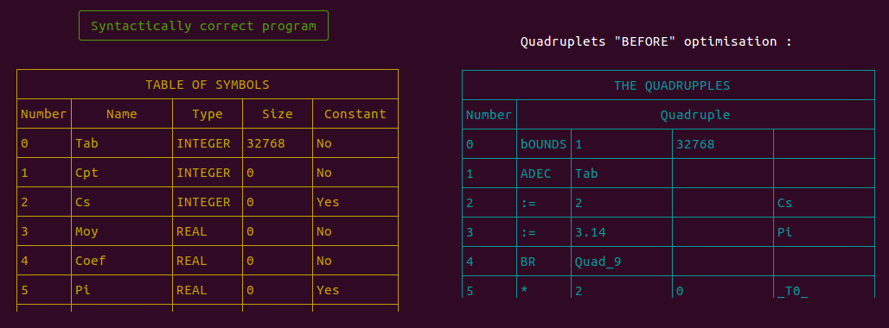
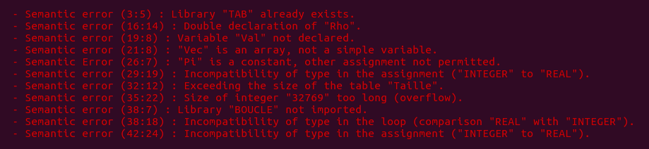

# Almost Complete Compiler
> A basic compiler for a non-existent programming language, which passes through the different compilation phases : lexical, syntactic, semantic analysis, quadruplets generation and their optimization.

## General info
Project released in **December 2018** as a university project, field : *Artificial Intelligence (AI)*, level : *Master 1*. The goal was to create a mini-compiler. Note that this compiler **does not generate the executable**.

## ScreenShots
<p align="center">
	
	
</p>

## Project content
```text
.
├── examples									<- Contains input source code (test files) for the compiler
│   ├── correct									<- Correct source code (without errors)
│   ├── error									<- Incorrect source code (whith errors)
│	└── correctProgram.png / errorProgram.png	<- Images used as illustration
│
├── include										<- Contains different treatments (functions and macros) used in "main" directory
│   ├── arith.c / arith.h						<- "Reverse Polish Notation" (to evaluate arithmetic expressions) structure and its functions
│   ├── general.c / general.h					<- Functions and macros used in multiple ".c" files
│   ├── quadruplets.c / quadruplets.h			<- Quadruplet structure and its functions
│   ├── routine.c / routine.h					<- Semantic routines and quadruplets optimisation
│   ├── semantic.c / semantic.h					<- Some semantic treatments
│   ├── stack.c / stack.h						<- Stack (LIFO list) structure and its functions
│   └── symbolsTable.c / symbolsTable.h			<- Table of Symbols structure and its functions
│
├── main										<- Contains main files of the different compilation phases
│   ├── lexical.l								<- Lexical analysis file
│   └── synt.y									<- Syntactic and semantic analysis file (contains "main()")
│
├── comd.sh										<- Setup file to create the compiler
└── Readme.md									<- Current project info
```

## Technologies
- **C** (pure language, no frameworks or external libraries).
- **Flex** (Lexical analyzer, uses **lex** programming language).
- **Bison** (Syntactic / semantic analyzer, uses **yacc** programming language).

## Setup
Check that you have the necessary tools to run the compiler (see section above). Then, just compile the project :
```bash
$ ./comd.sh
```

## Code examples
To use, pass the source code (of the non-existing language) as an input parameter to the executable ("compiler") :
```bash
$ ./compiler < examples/correct		# Correct source code (without errors)
$ ./compiler < examples/error		# Incorrect source code (with different errors)
```

## Features
* [*lexical analysis*](https://en.wikipedia.org/wiki/Lexical_analysis) : Display errors and their position (row and column).
	* Non-recognized entity.
* [*Syntactic analysis*](https://en.wikipedia.org/wiki/Parsing) : Display errors and their position (row and column).
* [*Semantic analysis*](https://en.wikipedia.org/wiki/Semantic_analysis_(compilers)) : Multiple types of errors detected :
	*  Check the library import needed for a given treatment or type.
	* Check "non declaration" or "double declaration" of a variable.
	* Check the type compatibility in "assignment" or "comparison".
	* Check the size of variables and overflows.
* *Quadruplets generation and their optimization* :
	* Algebraic simplification.
	* Constant propagation.

## To do list
* Generate the executable from optimized quadruplets according to a particular processor architecture.

## Status
Since this project was developed as a practical university work, it **will no longer be developed or improved**.
